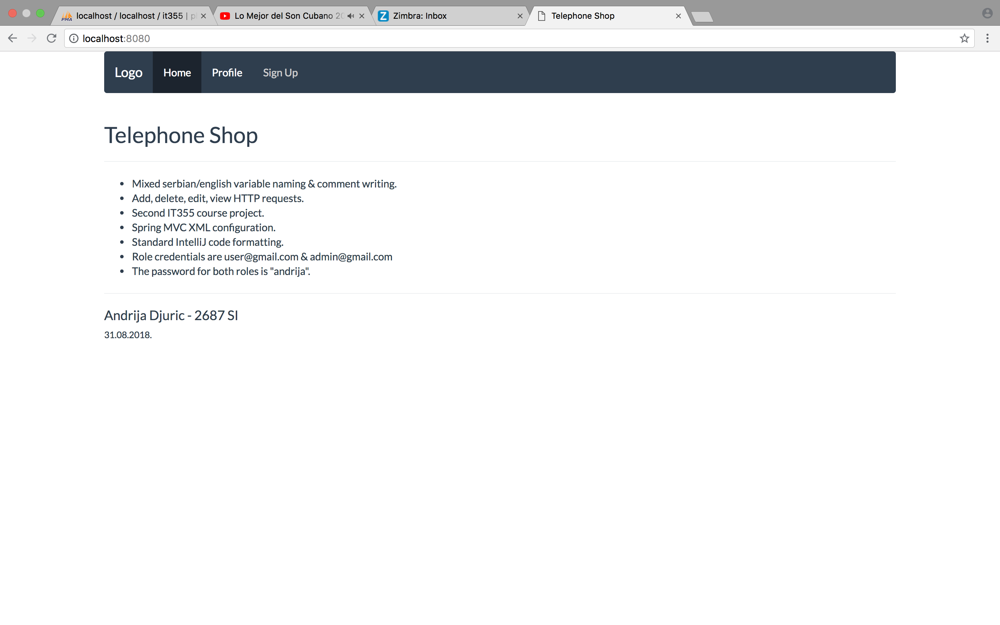
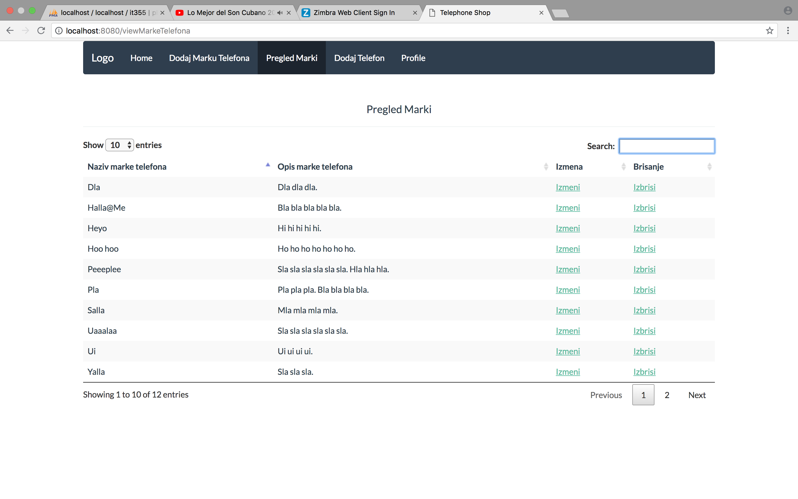
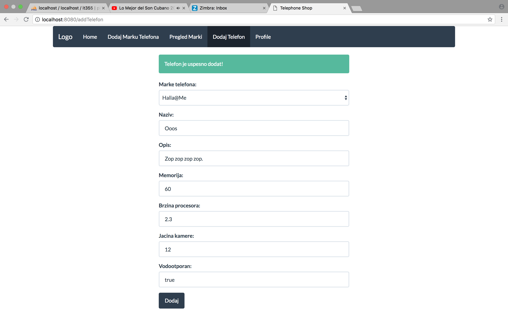
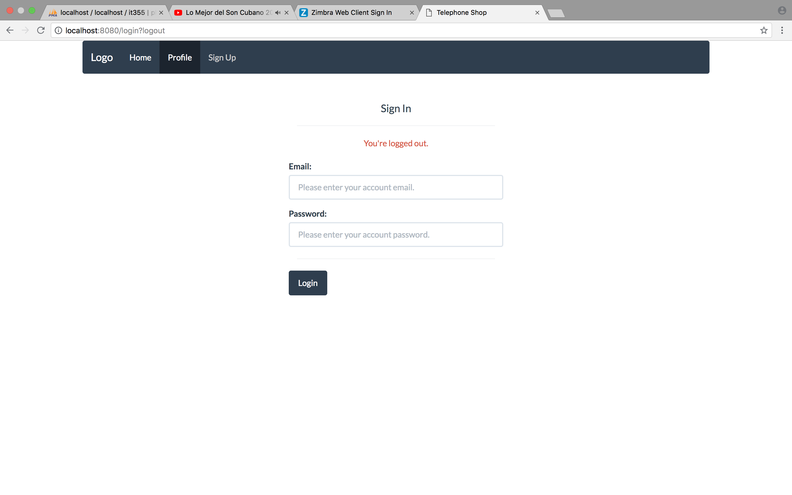

# it355-spring-mvc-master 🚦
<h3>A second year university Spring MVC project. 🚥</h3>
<ul>
  <li>Made for the <b>IT355 Web Services II</b> course. 🍏</li>
  <li>Has a MySQL database.</li>
  <li>All app view snapshots are collected in the <b>screen-shots</b> dir.</li>
  <li>The web app is created for an imaginary telephone sales company.</li>
  <li>Comments, variables, services, functions and components are written in mixed serbian/english.</li>
  <li>Has a shallow, test only front-end.</li>
</ul>
<h3>Project boot. 🏴</h3>

The development IDE is IntelliJ IDEA. In order to deploy this app to localhost,
you'll need to start a Tomcat (TomEE) Server which will push the app to your
chosen browser. I've also added a sql file that you can use in your database manager to create and 
insert a couple of rows of info.

<h3>A short personal note. 🏴</h3>

I'm not really interested in the Java Spring Framework, but it helped me better understand REST services,
HTTP requests, web components development, database and security configurations. Woo woo!

<h3>Project snapshots:</h3>

This is the landing page with a few more example views. Check out more snapshots in the mentioned folder above.

Home View

Example View 1

Example View 2

Example View 3

